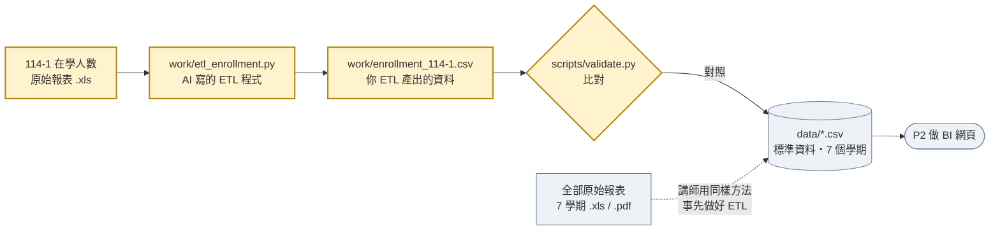

# P1 ETL（12 分鐘）

ETL 是 Extract（擷取）、Transform（轉換）、Load（載入）：從原始報表取出資料，轉成可以分析的格式，再存成後續要用的檔案。

原始報表是給人看的，不是給程式用的：有合併儲存格、合計列、備註。這一段請 AI 把 **一份** 報表（114-1 在學人數）轉成整齊的 CSV，再用驗證腳本確認結果正確。

## 流程

黃色是這一段要做的部分。



## Prompt

```text
請用 Python + uv，把「東華大學統計資料/在學人數統計表/」裡 114-1 的那一份 .xls 轉成整齊的 CSV。

輸出：
- CSV 存到 work/enrollment_114-1.csv，編碼 UTF-8 with BOM
- 程式存到 work/etl_enrollment.py

規則：
- 只讀第一個工作表
- 每一列是一個「系所 × 學制 × 性別」，欄位為 college, dept_raw, program_raw, gender, count
- college 去掉括號裡的註記，例如「環境暨海洋學院(111更名)」寫成「環境暨海洋學院」
- dept_raw 保留報表原文（含括號）
- program_raw 只會是：博士班、碩士班、碩士在職專班、學士班（「碩專班 合計3」底下的就是碩士在職專班）
- gender 是 女 或 男；count 取「總計」底下的女、男兩欄；人數是 0 的列也保留
- 排除總計、合計列和最下方的備註
- 注意合併儲存格，學院與系所名稱只寫在合併範圍的第一格
- 同一系所、同一學制下的多個分組要加總成一列
- 用 uv 的 inline script metadata 宣告需要的套件
- 不要修改 data/ 裡的檔案

完成後執行：
uv run scripts/validate.py enrollment work/enrollment_114-1.csv
如果有不符，找出原因並修正，最多修 3 次。最後用 3 句話告訴我：你遇到最麻煩的資料問題是什麼。
```

## 看結果

- 看到 `🎉 全部通過` 就完成了。
- 時間到還沒通過也沒關係，直接進 P2。P2 用的是 `data/` 裡 7 個學期的完整資料，那份資料就是用同樣的 ETL 方法產出的。

---

改一改（選做）：自己用 Excel 打開你的 CSV 和原始 .xls，挑一個系所，對照兩邊的數字。
